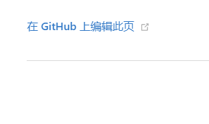

# PeterJXL Blog

博客地址 👉 ：https://www.peterjxl.com

本站大部分文章都是作者原创（转载会注明出处），内容包括：计算机基础、Java、职场、效率软件、英语.... 长期更新，全部开源，欢迎 Star！

本人热爱计算机，未来想要自己“实现”一台计算机，从零开始写 CPU + 操作系统 + 编译原理 + 网络协议 + ... 想要自己写一套计算机基础的书，让所有人都能拥有扎实的基础，提高我国的计算机水平，而不是做一个 CURD Boy，API Caller，CV 工程师...

本人利用业余时间不断学习，坚持输出文章两年多，不知不觉博客数量已经 900+ 了 😀

## 📖 计算机基础系列

* [计算机历史](https://www.peterjxl.com/ComputerHistory/)
* [数字电路](https://www.peterjxl.com/ComputerDigital/)
* [计算机组成原理](https://www.peterjxl.com/ComputerOrganization/)
* [操作系统](https://www.peterjxl.com/ComputerOS/)
* [Linux](https://www.peterjxl.com/Linux/)
* [Docker](https://www.peterjxl.com/Docker/)
* [计算机网络](https://www.peterjxl.com/Network/)
* [计算机常识](https://www.peterjxl.com/literacy/)
* [MySQL](https://www.peterjxl.com/MySQL/)
* [Git](https://www.peterjxl.com/Git/)
* ...

## 📖 Java 系列

Java 基础部分：

* [JavaSE](https://www.peterjxl.com/JavaSE/)
* [Java高级](https://www.peterjxl.com/JavaSenior/)
* ...

Java EE 部分：

* [构建、依赖管理](https://www.peterjxl.com/JavaEE/1-Build/)
* [Ant](https://www.peterjxl.com/JavaEE/Ant/)
* [Maven](https://www.peterjxl.com/JavaEE/Maven/)
* [日志框架](https://www.peterjxl.com/JavaEE/Log4j/)
* [Junit](https://www.peterjxl.com/JavaEE/Junit/)
* [JDBC](https://www.peterjxl.com/JavaEE/JDBC/)
* [XML与JSON](https://www.peterjxl.com/JavaEE/XML-JSON/)
* ...

JavaWeb：

* [服务器软件](https://peterjxl.com/JavaWeb/Web-Container/)
* [环境管理和配置管理-科普篇](https://peterjxl.com/JavaWeb/environment-and-code-version-manage/)
* [Servlet](https://peterjxl.com/JavaWeb/Servlet/)
* ...

Spring：

* [Spring 基础](https://peterjxl.com/Spring-Basic/)
* [SpringMVC](https://peterjxl.com/SpringMVC-Basic/)
* [SpringBoot](https://peterjxl.com/SpringBoot-Basic/)
* ...

主流框架：

* [Redis](https://peterjxl.com/Java-Framework/Redis/)
* [Mybatis](https://peterjxl.com/Java-Framework/Mybatis/)
* [Lucene](https://peterjxl.com/Java-Framework/Lucene/)
* [Elasticsearch](https://peterjxl.com/Java-Framework/Elasticsearch/)
* [RabbitMQ](https://peterjxl.com/Java-Framework/RabbitMQ/)
* [MyCat](https://peterjxl.com/Java-Framework/MyCat/)
* [Lombok](https://peterjxl.com/Java-Framework/Lombok/)
* ...

## 📖 从零开始学英语：

* [教程简介](https://peterjxl.com/English/Introduce/)
* [英语学习方法](https://peterjxl.com/English/Learning-Methodology/)
* [字母](https://peterjxl.com/English/Alphabet/)
* [音标](https://peterjxl.com/English/Symbols/)
* [单词](https://peterjxl.com/English/Word/)
* [语法](https://peterjxl.com/English/Grammar/)
* [英语兔的相关视频](https://peterjxl.com/English/yingyutu/)
* [Larry想做技术大佬的相关视频](https://peterjxl.com/English/Larry/)
* ...

## 📖 职场系列：

* [五险一金等](https://peterjxl.com/Job/Social-welfare/)
* [职场规划](https://peterjxl.com/Job/career-planning/)
* ...

## 📖 效率软件：

* [Windows使用技巧等 ](https://peterjxl.com/Windows/)
* [输入法 ](https://peterjxl.com/TypeWriting/)
* [浏览器 ](https://peterjxl.com/Browser/)
* [终端相关博客 ](https://peterjxl.com/Terminal/)
* [装机相关博客 ](https://peterjxl.com/Computer-Diy/)
* ...

### 📖搭建博客

写了一套从零开始搭建博客的教程，详细描述了本博客是如何搭建的，欢迎阅读：

[从零开始搭建博客](https://peterjxl.com/Blog/)

### 📖其他博客

还有一些零零散散的博客，暂时不成体系，后续完善：

* [月薪3000就不用纳税了？](https://www.peterjxl.com/economy/revenue/tax-in-china/)
* [我们每个月到底要交多少税？](https://www.peterjxl.com/economy/revenue/tax-monthly/#总结)
* [《斯坦福高效睡眠法》](https://www.peterjxl.com/sleep/Stanford-Efficient-Sleep-Method/)
* [记一次祛痣](https://www.peterjxl.com/fitness/skin/nevus/)
* [口腔健康系列](https://www.peterjxl.com/Oral-health/)
* ......

年终总结系列：

* [2022年度总结](https://www.peterjxl.com/About/summary-2022/)
* [2023年度总结](https://www.peterjxl.com/About/summary-2023/)
* ......

更多内容可以参考顶部的菜单栏，或参考[网站动态](https://www.peterjxl.com/About/WebLog/) 与 [时光轴](https://www.peterjxl.com/archives/)

## 友情链接

欢迎添加友链 👋：[友人帐](https://peterjxl.com/About/friend-link/)

## RSS

本站也支持 RSS：https://www.peterjxl.com/rss.xml

## 公众号

新开了个微信公众号，原因如下：

1. 该网站是个人网站，用爱发电，服务器、CDN、域名、证书都是要钱的；而微信公众号是免费的，不用担心成本问题。
2. 个人博客经常被 DDoS 攻击，费用也很高，容易导致网站打不开；而微信公众号不用担心这个问题，随时随地都能阅读，速度也很快；
3. 写技术文章，几乎不可避免会被抄袭。抄袭者会将文章标为“原创”，甚至在文中加入广告，但个人网站很难证明自己的原创性；而微信公众号可以。
4. 个人网站的流量主要来自搜索引擎，但搜索引擎对个人网站的收录和排名非常不友好；微信公众号的流量主要来自用户，用户可以主动搜索和关注。
5. 方便推送。虽然本站也支持 RSS，但对于普通用户还是有点难度的，毕竟 RSS 越来越不流行了；而微信离读者更近，对读者来说订阅公众号比收藏博客更方便。
6. 一点小“私心”：同等流量规模下微信变现比网站变现更容易，如果能靠自媒体吃饭，我就能有更多的时间学习、输出博客了。

文章会逐步迁移到公众号上，最新文章都会在公众号首发，欢迎关注！

## 勘误及提问

如果有疑问或者发现错误，可以在对应的文章底部留言，也可以点击对应文章底部的“在 GitHub 上编辑此页”并提交 PR：

## 求 Star

如果喜欢或者有所启发，欢迎 Star，对作者也是一种鼓励 ❤❤❤

