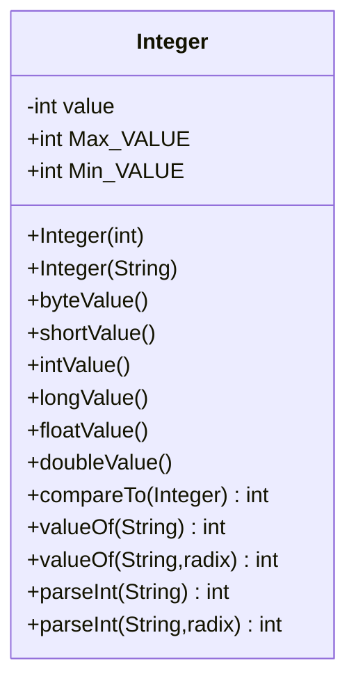

# 30.基本包装类型


介绍下Java的包装类型。

<!-- more -->

## 什么是基本包装类型

　　处理对象需要额外的开销（例如申请内存，分配内存等），因此基本数据类型是不作为对象使用的（提高性能）。

　　但是，Java的很多方法都需要将对象作为参数，因此，Java提供了包装类型。例如，将int包装成Integer类，double包装成Double类。

　　Java为基本数据类型提供了 Byte、Short、Integer、Long 、Float、 Double、Boolean、Character等包装类，这些包装类都在java.lang包里，因此可以直接使用，不用import。

> 大部分包装类的名称和基本数据类型的名称一样，但首字母大写（Integer和Character除外）

　　‍

　　‍

## 包装类型的常用方法和属性

　　大部分包装类之间的方法都很类似，主要分为以下几类

* 构造方法
* `valueOf()`: 包装类的静态方法，用于创建一个包装对象
* 一组将包装类转换成基本数据类型的方法，方法名类似于 `dataTypeValue()`
* 一组类似`pareDataType()`的方法，用来转换为基本数据类型（可以添加参数radix，标明转换的基数）
* `compareTo()` 比较大小

　　‍

　　例如，Integer的类图如下（其他包装类也类似）。我们依次来介绍并实践各个方法



　　‍

　　‍

### 构造方法

　　可以用基本数据类型值，也可以字符串来构造包装类。例如，newDouble(5.0)、new Double("5.0")、new Integer（5)和 new Integer("5")。

> 包装类没有无参构造方法。所有包装类的实例都是不可变的，这意味着一旦创建对象后，它们的内部值就不能再改变。

　　‍

　　示例代码如下：

```java
// 演示包装类的构造方法

public class WrapperClassDemo{
  public static void main(String[] args) {
    byte b = 1;
    Byte byte1 = new Byte(b);
    Byte byte2 = new Byte("112");
    System.out.println("Byte: " + byte1 + ' ' + byte2);

    short s = 1;
    Short short1 = new Short(s);
    Short short2 = new Short("112");
    System.out.println("Short:"  + short1 + ' ' + short2);

    Integer int1 = new Integer(111);
    Integer int2 = new Integer("112");
    System.out.println("Integer:"  + int1 + ' ' + int2);

    Long long1 = new Long(111L);
    Long long2 = new Long("112");
    System.out.println("Long:"  + long1 + ' ' + long2);

    Float float1 = new Float(11.1f);
    Float float2 = new Float("11.2");
    System.out.println("Float:"  + float1 + ' ' + float2);

    Double double1 = new Double(11.1);
    Double double2 = new Double("111.22");
    System.out.println("Double:"  + double1 + ' ' + double2);


    char c = 'A';
    Character char1 = new Character(c);
    Character char2 = new Character('A');
    System.out.println("Character:"  + char1 + ' ' + char2);

    Boolean boolean1 = new Boolean("true");
    Boolean boolean2 = new Boolean("True");
    Boolean boolean3 = new Boolean(true);
    System.out.println("Boolean:"  + boolean1 + ' ' + boolean2 + ' ' + boolean3);
  }
}

```

　　‍

　　‍

### `valueOf()`

　　包装类有一个有用的静态方法，`vauleOf()`，其参数可以是基本数据类型  和 字符串，该方法创建一个新对象，并将其初始化为参数所表示的值。

　　‍

　　演示如下：代码和上一小节类似。

```java
public class WrapperClassDemo2 {
  public static void main(String[] args) {
    byte b = 1;
    Byte byte1 = Byte.valueOf(b);
    Byte byte2 = Byte.valueOf("112");
    System.out.println("Byte: " + byte1 + ' ' + byte2);

    short s = 1;
    Short short1 = Short.valueOf(s);
    Short short2 = Short.valueOf("112");
    System.out.println("Short:"  + short1 + ' ' + short2);

    Integer int1 = Integer.valueOf(111);
    Integer int2 = Integer.valueOf("112");
    System.out.println("Integer:"  + int1 + ' ' + int2);

    Long long1 = Long.valueOf(111L);
    Long long2 = Long.valueOf("112");
    System.out.println("Long:"  + long1 + ' ' + long2);

    Float float1 = Float.valueOf(11.1f);
    Float float2 = Float.valueOf("11.2");
    System.out.println("Float:"  + float1 + ' ' + float2);

    Double double1 = Double.valueOf(11.1);
    Double double2 = Double.valueOf("111.22");
    System.out.println("Double:"  + double1 + ' ' + double2);


    char c = 'A';
    Character char1 = Character.valueOf(c);
    Character char2 = Character.valueOf('A');
    System.out.println("Character:"  + char1 + ' ' + char2);

    Boolean boolean1 = Boolean.valueOf("true");
    Boolean boolean2 = Boolean.valueOf("True");
    Boolean boolean3 = Boolean.valueOf(true);
    System.out.println("Boolean:"  + boolean1 + ' ' + boolean2 + ' ' + boolean3);


  }
}
```

　　‍

### `dataTypeValue()`

　　大部分包装类都有一组类似 `dataTypeValue()`的方法：

* `byteValue()`
* `shortValue()`
* `intValue()`
* `longValue()`
* `floatValue()`
* `doubleValue()`
* `booleanValue()`
* `charValue()`

　　这些方法返回包装类 包装的基本数据类型。注意：返回数制类型的`dataTypeValue()` 只有数值类的包装类才有。返回`booleanValue()`的只有Boolen包装类才有，`charValue()`同理。

　　‍

　　‍

```java
//演示 dataTypeValue方法
public class WrapperClassDemo3 {
  public static void main(String[] args) {
    Integer integer = new Integer(111);
    byte b1 = integer.byteValue();
    short s1 = integer.shortValue();
    int i1 = integer.intValue();
    long l1 = integer.longValue();
    float f1 = integer.floatValue();
    double d1 = integer.doubleValue();

    System.out.println("b1: " + b1);
    System.out.println("s1: " + s1);
    System.out.println("i1: " + i1);
    System.out.println("l1: " + l1);
    System.out.println("f1: " + f1);
    System.out.println("d1: " + d1);

    Boolean b = new Boolean(true);
    boolean boolean1 =  b.booleanValue();
    System.out.println("boolean1: " + boolean1);

    Character c = new Character('a');
    char c1 = c.charValue();
    System.out.println("c1: " + c1);
  

  }
}
```

　　‍

　　‍

　　‍

### `pareDataType()`

　　大部分包装类都有一组类似 `pareDataType()`的方法：

* `Integer.pareInt(String s)`：将一个数值字符串转为int值
* `Double.parseDouble(String s)`：将一个数值字符串转为double值

　　‍

　　默认情况下，Java是将数值字符串当成10进制下的值，但有个重载的方法`Integer.pareInt(String s, int radix)`，可以说明数值字符串的基数，例如说明该数是2进制下的：

```java
public class WrapperClassDemo6 {
  public static void main(String[] args) {
    System.out.println(Integer.parseInt("11"));
    System.out.println(Integer.parseInt("11",2)); //将二进制数11转为十进制数，输出3
    System.out.println(Integer.parseInt("11",8)); //将八进制数11转为十进制数，输出9
    System.out.println(Integer.parseInt("11",16));//将16进制数11转为十进制数，输出17
  }
}
```

　　‍

　　‍

　　注意，要转换的数值字符串得是合法的，例如将`Integer.parseInt("12",2)`会发生错误。因为二进制数里没有2.

　　‍

> 如果要反过来，将一个十进制数转为其他进制，可以用String的format方法
>
> ```java
> String.format("%x", 26)); //将26转为十六进制，也就是1a
> ```

　　‍

　　‍

　　更多参数说明：

|转换|参数类别|说明|
| ---------| -----------| ------------------------------------------------------------------------------------------------------------|
|'b','B'|常规|如果参数*arg*为null，则结果为 "false"。如果*arg*是一个boolean值或`Boolean`，则结果为`String.valueOf()`返回的字符串。否则结果为 "true"。|
|'h','H'|常规|如果参数*arg*为null，则结果为 "null"。否则，结果为调用Integer.toHexString(arg.hashCode())得到的结果。|
|'s','S'|常规|如果参数*arg*为null，则结果为 "null"。如果*arg*实现`Formattable`，则调用`arg.formatTo`。否则，结果为调用arg.toString()得到的结果。|
|'c','C'|字符|结果是一个 Unicode 字符|
|'d'|整数|结果被格式化为十进制整数|
|'o'|整数|结果被格式化为八进制整数|
|'x','X'|整数|结果被格式化为十六进制整数|
|'e','E'|浮点|结果被格式化为用计算机科学记数法表示的十进制数|
|'f'|浮点|结果被格式化为十进制数|
|'g','G'|浮点|根据精度和舍入运算后的值，使用计算机科学记数形式或十进制格式对结果进行格式化。|
|'a','A'|浮点|结果被格式化为带有效位数和指数的十六进制浮点数|
|'t','T'|日期/时间|日期和时间转换字符的前缀。请参阅日期/时间转换。|
|'%'|百分比|结果为字面值'%'('\u0025')|
|'n'|行分隔符|结果为特定于平台的行分隔符|

　　‍

　　‍

　　‍

### `compareTo()`

　　String类的`compareTo()`方法用来比较两个字符串，包装类中`compareTo()`则用于比较两个数值，大于时返回1，等于时返回0，小于是返回-1。

```java
public class WrapperClassDemo5 {
  public static void main(String[] args) {
    int b1 = new Double(12.4).compareTo(new Double(12.3));
    int b2 = new Double(12.3).compareTo(new Double(12.3));
    int b3 = new Double(12.3).compareTo(new Double(12.4));

    System.out.println("b1: " + b1);
    System.out.println("b2: " + b2);
    System.out.println("b3: " + b3);
  }
}
```

　　‍

　　‍

```java
b1: 1
b2: 0 
b3: -1
```

　　‍

### MAX_VALUE 和 MIN_VALUE

　　每一个数值包装类都有常量 MAX_VALUE 和 MIN_VALUE。

* 对于 Byte 、 Short、Integer 和 Long 而言，MIN_VALUE 表示对应的基本类型byte、short、int 和 long 的最小值。
* 对 Float 和 Double 类而言，MIN_VALUE 表示 float 型 和 double 型的最小正值。

　　‍

　　演示如下：

```java
public class WrapperClassDemo4 {
  public static void main(String[] args) {

    System.out.println("Byte.MAX_VALUE: " + Byte.MAX_VALUE);
    System.out.println("Byte.MIN_VALUE: " + Byte.MIN_VALUE);

    System.out.println("Integer.MAX_VALUE: " + Integer.MAX_VALUE);
    System.out.println("Integer.MIN_VALUE: " + Integer.MIN_VALUE);

    System.out.println("Float.MIN_VALUE: " + Float.MIN_VALUE);
    System.out.println("Float.MAX_VALUE: " + Float.MAX_VALUE);

    System.out.println("Double.MIN_VALUE: " + Double.MIN_VALUE);
    System.out.println("Double.MAX_VALUE: " + Double.MAX_VALUE);
  }
}

```

　　‍

　　输出如下：

```java
Byte.MAX_VALUE: 127
Byte.MIN_VALUE: -128
Integer.MAX_VALUE: 2147483647
Integer.MIN_VALUE: -2147483648
Float.MIN_VALUE: 1.4E-45
Float.MAX_VALUE: 3.4028235E38
Double.MIN_VALUE: 4.9E-324
Double.MAX_VALUE: 1.7976931348623157E308
```

　　‍

　　‍

## 🌟基本类型和包装类型之间的自动转换

　　根据代码的上下文，基本数据类型值可以使用自动转换成一个对象（这个过程称为装箱，boxing），反过来一个包装类也可以自动转换成基本数据类型（这个过程称为开箱， unboxing ）。

　　Java 允许基本类型和包装类类型之间进行自动转换：

* 如果一个基本类型值出现在需要对象的环境中，编译器会将基本类型值进行自动装箱；
* 如果一个对象出现在需要基本类型值的环境中，编译器会将对象进行自动开箱。

　　这称为自动装箱和自动开箱。

　　例如，以下语句是等价的：

```java
Integer intObject = new Integer(5);
Integer intObject2 = 5;
```

　　‍

　　在计算和创建对象的时候，也会在i动装箱和拆箱

```JAVA
    Integer[] intArray = {1,2,3};
    System.out.println(intArray[0] + intArray[1] + intArray[2]);
```

　　第一行中，基本数据类型1,2,3会被自动装箱为对象`Integer(1)`, `Integer(2)`, `Integer(3)`。

　　第二行中，对象`intArray[0]`，`ntArray[1] `，`ntArray[2] `会被自动转换成int值，然后相加

　　‍

　　‍

## 缓存的踩坑

　　观察以下代码，推理下应该输出什么？

```java
public class BigIntegerDemo3 {
  public static void main(String[] args) {
    Integer a = 1000, b = 1000;
    System.out.println("a==b? : " + (a == b));

    Integer c = 100, d = 100;
    System.out.println("a==b? : " + (c == d));
  }
}

```

　　答案是

```java
a==b? : false
a==b? : true
```

　　‍

　　‍

　　我们知道，当两个对象用 == 比较的时候，会比较是否同一个引用。如果不是同一个，会返回false。那为什么第二个返回true呢？

　　其实，当我们这样声明对象的时候`Integer c = 100`，会调用`public static Integer valueOf(int i) `进行自动装箱，类似这样：

```java
Integer c = Integer.valueOf(100);
```

　　‍

　　‍

　　我们可以看看valueOf方法的代码：（在Integer.java的第829行）

```java
public static Integer valueOf(int i) {
        if (i >= IntegerCache.low && i <= IntegerCache.high)
            return IntegerCache.cache[i + (-IntegerCache.low)];
        return new Integer(i);
}
```

　　如果值的范围在-128到127之间，它就从数组cache里缓存返回一个实例，否则返回一个新对象。

　　‍

　　‍

　　我们继续看IntegerCache是什么：是一个内部私有类IntegerCache，其内部缓存了从 -128 ~ 127的所有整数对象。

```java
private static class IntegerCache {
        static final int low = -128;
        static final int high;
        static final Integer cache[];
	//省略部分代码
	for(int k = 0; k < cache.length; k++)
                cache[k] = new Integer(j++);
	//省略部分代码
}
```

　　‍

　　‍

　　所以，`Integer c = 100, d = 100;` 这句代码中，两者指向的是同一个对象，因此用 == 判断得到的是true。

　　‍

　为什么会使用缓存数组？因为小整数使用的频率较高，使用缓存能提高效率，减少内存占用，提高性能（就好比CPU就有高速缓存）

除了Integer类之外，其他的包装类也存在类似的设计（Byte，short，Long等），感兴趣的读者请自行看源码。

知道这个特性，对日常开发有什么影响吗？比较两个数是否相等在计算机里是很常用的，并且后面我们会讲到反射，知道这个细节，可以让你不误用。
　　‍
> 另外要注意的是，new的Integer对象不适用缓存数组
>
> ```java
> Integer d1 = new Integer(1);
> Integer d2 = new Integer(1);
> System.out.println(d1 == d2); //false
> ```


## equals的踩坑

以Integer为例，equals方法具体代码如下：

```java
public boolean equals(Object obj) {
    if (obj instanceof Integer) {
        return value == ((Integer)obj).intValue();
    }
    return false;
}
```


先判断参数obj是否是Integer类型，如果不是，则直接返回false。如果是Integer类型，再进一步判断int值是否相等。也就是说，如果调用了Integer的equals方法，必须要求入参也是Integer类型，否则该方法会直接返回false。演示如下：

```java
    long long1 = 1000L;
    Integer integer = 1000;
    System.out.println( long1 == integer);  //true
    System.out.println( integer.equals(long1)); //flase
```

即使调用`Objects.equals()` 也是一样的，因为其内部也还是调用对象的`equals`方法。


## 小结

　本文讲了如下内容：

* 什么是包装类
* 包装类的常用方法
* 包装类的常用属性
* 包装类的自动装箱和拆箱
* 数值包装类的缓存数组
* 数值包装类的equals的坑

　　‍

　　本文相关代码已上传至：[01.JavaSE/05.OOP/25.WrapperClass · 小林/LearnJava - 码云 - 开源中国](https://gitee.com/peterjxl/LearnJava/tree/master/01.JavaSE/05.OOP/25.WrapperClass)

　　请读者务必根据自己动手敲一遍本文提及的代码

　　‍

## 参考

　　《Java语言程序设计-基础篇》第10.7节

　　[Integer缓存IntegerCache详解_谷哥的小弟的博客-CSDN博客_integercache](https://blog.csdn.net/lfdfhl/article/details/110221963)

　　[为什么 Java 中“1000](https://mp.weixin.qq.com/s?__biz=MzIxMjE5MTE1Nw==&mid=2653211871&idx=2&sn=1bd2b487c36f1b537ed8b849bd4dfd76&chksm=8c99be05bbee3713c3fa2217e493948ebc2d6d37008b4a99bd5a4501ccbbee251f6cc21fc334&mpshare=1&scene=1&srcid=0910qPLVIga4QnySgndVqVpy&sharer_sharetime=1599725144054&sharer_shareid=5cc2777764c85c1d841997739b5bb6f4&key=ad479a0dc78b18f314b75646df0b2486353e2c8f7bbb47aa5b96698a4f43ca6ae94874e9e2360150fe0be9713c77ca5dd284a520b51133aa79bcfdc3c03ba10e374d85b7473c0d0ba7e61690b6fd72c76be3f859fbda989e64d52fa4b9734e8ec4d2db293d62be9bd193762e2b16aace432805de5d6a400f2133b17a255f54ba&ascene=1&uin=MzEzNTMxNzU5NQ%3D%3D&devicetype=Windows+10+x64&version=62090529&lang=zh_CN&exportkey=AYg79Bbcz43Os%2FZtVVJdVyA%3D&pass_ticket=ILCP%2F1aOSoxdBvYoh6UFyiqayEopSbUerx2rk7gbt3%2FfZ1hmRfSGhIOyj2a989NM&wx_header=0)[=1000”为false，而”100==100“为true？](https://mp.weixin.qq.com/s?__biz=MzIxMjE5MTE1Nw==&mid=2653211871&idx=2&sn=1bd2b487c36f1b537ed8b849bd4dfd76&chksm=8c99be05bbee3713c3fa2217e493948ebc2d6d37008b4a99bd5a4501ccbbee251f6cc21fc334&mpshare=1&scene=1&srcid=0910qPLVIga4QnySgndVqVpy&sharer_sharetime=1599725144054&sharer_shareid=5cc2777764c85c1d841997739b5bb6f4&key=ad479a0dc78b18f314b75646df0b2486353e2c8f7bbb47aa5b96698a4f43ca6ae94874e9e2360150fe0be9713c77ca5dd284a520b51133aa79bcfdc3c03ba10e374d85b7473c0d0ba7e61690b6fd72c76be3f859fbda989e64d52fa4b9734e8ec4d2db293d62be9bd193762e2b16aace432805de5d6a400f2133b17a255f54ba&ascene=1&uin=MzEzNTMxNzU5NQ%3D%3D&devicetype=Windows+10+x64&version=62090529&lang=zh_CN&exportkey=AYg79Bbcz43Os%2FZtVVJdVyA%3D&pass_ticket=ILCP%2F1aOSoxdBvYoh6UFyiqayEopSbUerx2rk7gbt3%2FfZ1hmRfSGhIOyj2a989NM&wx_header=0)

　　[Why 1000 == 1000 Returns False, but 100 == 100 Returns True in Java? - DZone](https://dzone.com/articles/why-1000-1000-returns-false-but-100-100-returns-tr)
