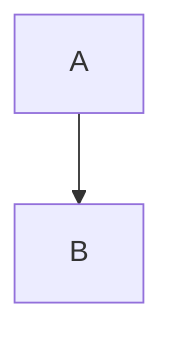
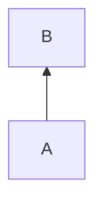
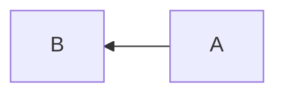
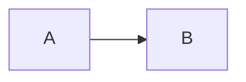
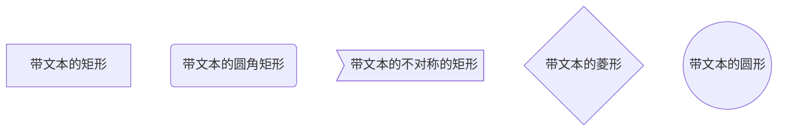
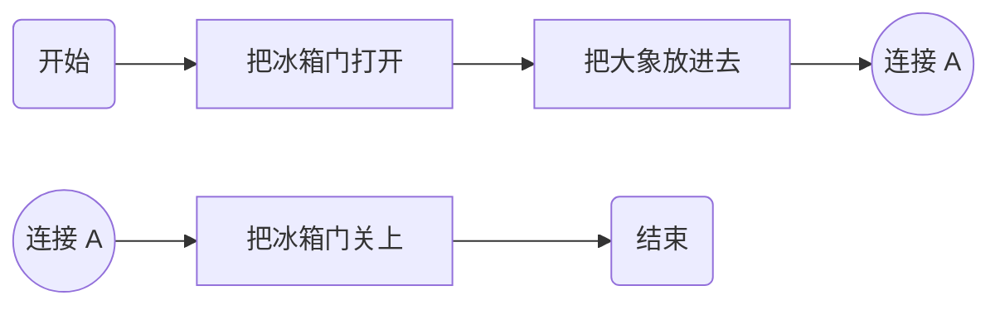
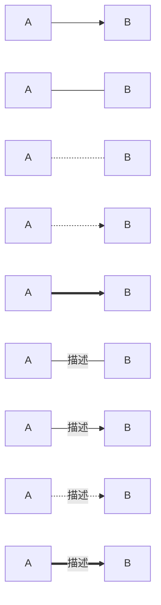
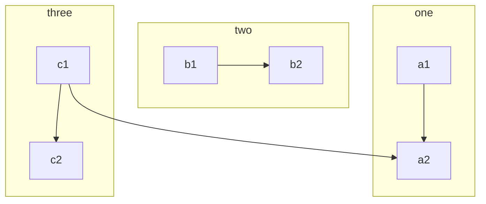
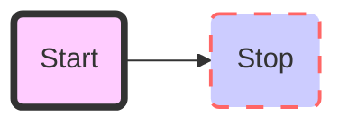
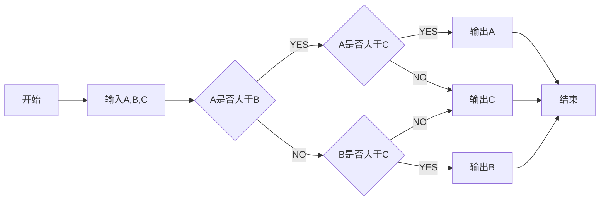

# 70.使用 Markdown 画流程图

流程图，顾名思义，就是表示一个事件或活动的流程的图示。

‍‍<!-- more -->

## 快速入门

最简单的例子：从 A 到 B

```md
graph TD
   A --> B
```


效果：




注意起始的关键字“grpah”是必须的，表明这是流程图。

后续介绍时序图时，该关键字也要改为时序图的关键字：sequenceDiagram。


## 方向


接下来我们讲讲基本的概念。流程图中，可以有方向：

* TB、TD：从上到下
* BT：从下到上
* RL：从右到左
* LR：从左到右


从下到上：

```md
graph BT
   A --> B 
```

效果：




从右到左：

```md
graph RL
   A --> B 
```

效果：





从左到右：

```md
graph LR
   A --> B 
```


效果：




最常用的布局方向是

* 从上向下
* 从左向右

当然也允许从下向上画、从右向左画，但是这两种很少见。


## 基本图形

节点除了矩形，还能换成其他形状，这里列出部分：

```md
graph TD
    id[带文本的矩形]
    id4(带文本的圆角矩形)
    id3>带文本的不对称的矩形]
    id1{带文本的菱形}
    id2((带文本的圆形))
```

效果：




注意，每个形状都是有各自含义的：

* **圆角矩形**：表示开始和结束
* **矩形**：表示过程，也就是整个流程中的一个环节
* **菱形**：表示判断、决策
* **圆形**：表示连接。为避免流程过长或有线段交叉，可将流程切开，圆形即相当于切口处的连接头（成对出现）





## 连接线

节点之间的连线，有如下类型：

* `A --> B`：A 带箭头指向 B
* `A --- B`：A 不带箭头指向 B
* `A -.- B`：A 用虚线指向 B
* `A -.-> B`：A 用带箭头的虚线指向 B
* `A ==> B`：A 用加粗的箭头指向 B
* `A -- 描述 --- B`： A 不带箭头指向 B 并在中间加上文字描述
* `A -- 描述 --> B`： A 带箭头指向 B 并在中间加上文字描述
* `A -. 描述 .-> B`： A 用带箭头的虚线指向 B 并在中间加上文字描述
* `A == 描述 ==> B`： A 用加粗的箭头指向 B 并在中间加上文字描述

注意，不同形状的线其实也有各自的含义。如果想要专业一点，可以专门去查查相关文档，什么情况用什么线。


示例：

```md
graph LR
    A[A] --> B[B] 
    A1[A] --- B1[B] 
    A4[A] -.- B4[B] 
    A5[A] -.-> B5[B] 
    A7[A] ==> B7[B] 
    A2[A] -- 描述 --- B2[B] 
    A3[A] -- 描述 --> B3[B] 
    A6[A] -. 描述 .-> B6[B] 
    A8[A] == 描述 ==> B8[B]
```


效果：




## 子流程图

语法：

```md
subgraph title
    graph definition
end
```


示例：

```md
graph TB
    c1-->a2
    subgraph one
    a1-->a2
    end
    subgraph two
    b1-->b2
    end
    subgraph three
    c1-->c2
    end
```


效果：




## 自定义样式

我们还可以定义边框的样式、颜色。

语法：

```md
style id 具体样式
```


示例：

```md
graph LR
    id1(Start)-->id2(Stop)
    style id1 fill:#f9f,stroke:#333,stroke-width:4px,fill-opacity:0.5
    style id2 fill:#ccf,stroke:#f66,stroke-width:2px,stroke-dasharray: 10,5
```


效果：




## 实际案例

说了这么多，来做个有实际价值的案例：绘制一个流程图，找出 A、 B、 C 三个数中最大的一个数。


```md
graph LR
    start[开始] --> input[输入A,B,C]
    input --> conditionA{A是否大于B}
    conditionA -- YES --> conditionC{A是否大于C}
    conditionA -- NO --> conditionB{B是否大于C}
    conditionC -- YES --> printA[输出A]
    conditionC -- NO --> printC[输出C]
    conditionB -- YES --> printB[输出B]
    conditionB -- NO --> printC[输出C]
    printA --> stop[结束]
    printC --> stop
    printB --> stop
```

效果：




## 参考

[如何在 Markdown 中画流程图 - 简书](https://www.jianshu.com/p/b421cc723da5)

[Markdown 进阶技能：用代码画流程图（编程零基础也适用）](https://mp.weixin.qq.com/s/ztrOApJcEEld-Tem77njXQ)