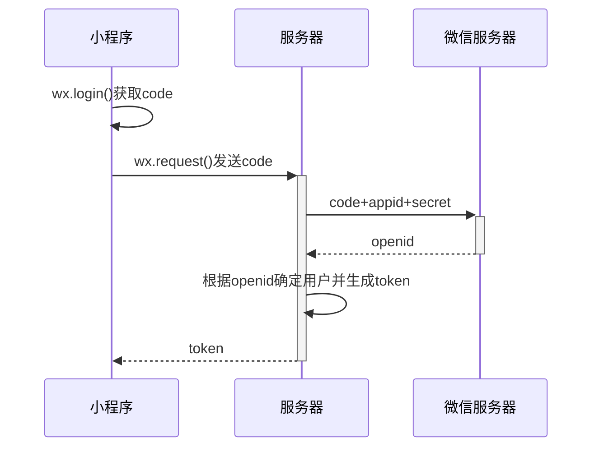
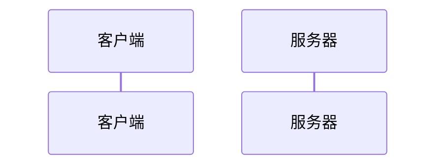
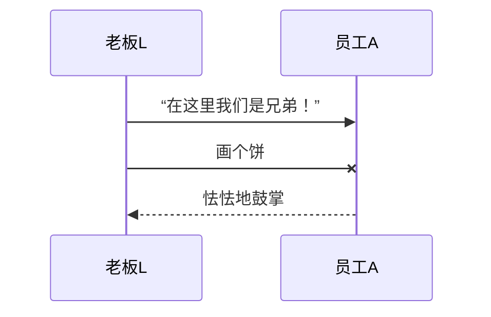
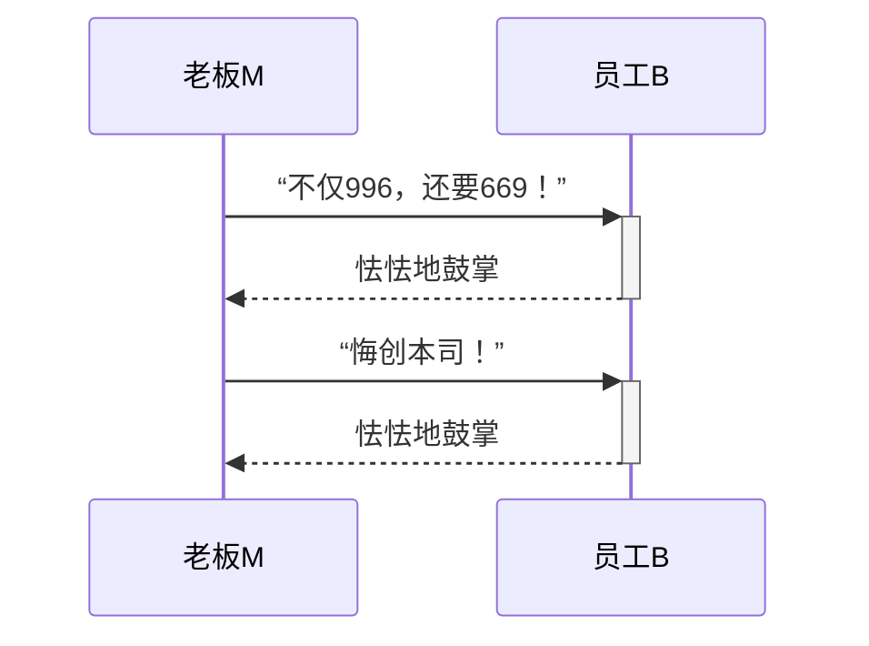
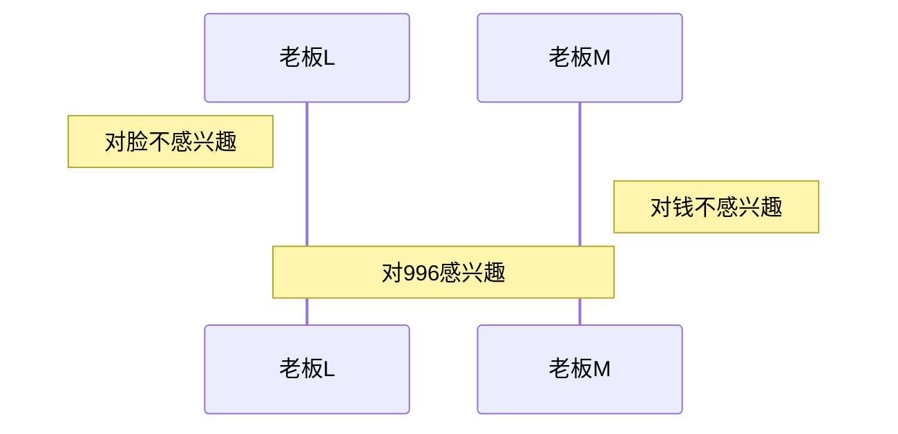
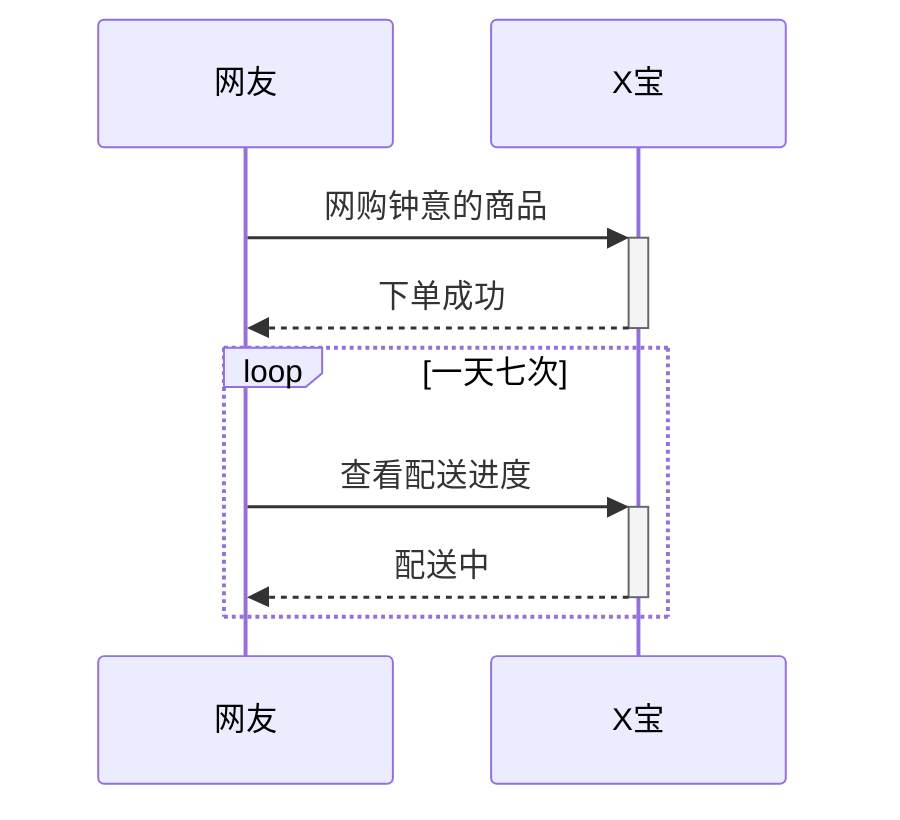
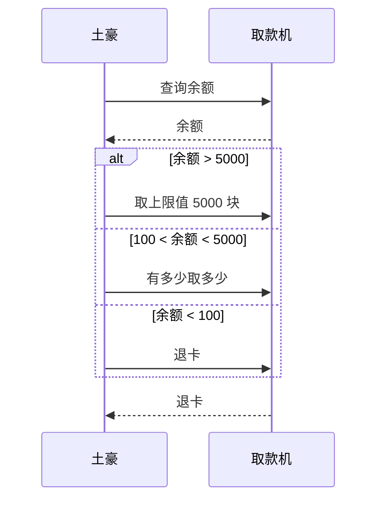
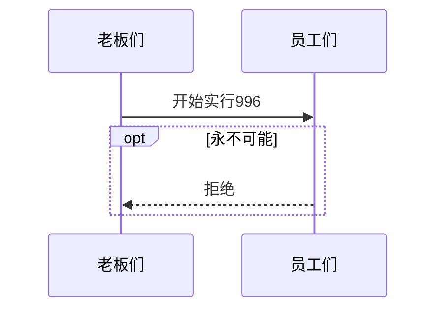
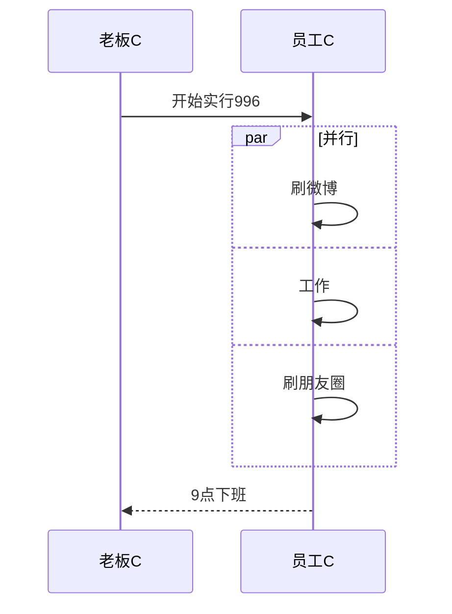

# 80.使用 Markdown 画时序图

时序图是一种表现交互过程的图示，主要展示各个参与者之间是如何交互的，以及交互的顺序是怎样的。

<!-- more -->

## 快速入门

听不太懂？没关系，看个例子，下图是小程序登陆过程中，小程序、服务器、微信服务器三者交互的时序图：




而画这幅图只用了很少并且很简单的代码：

```md
sequenceDiagram
    小程序 ->> 小程序 : wx.login()获取code
    小程序 ->> + 服务器 : wx.request()发送code
    服务器 ->> + 微信服务器 : code+appid+secret
    微信服务器 -->> - 服务器 : openid
    服务器 ->> 服务器 : 根据openid确定用户并生成token
    服务器 -->> - 小程序 : token
```


接下来讲讲一些术语和概念。


## 参与者

参与者，简单来说就是参与交互的事务，例如人，系统，服务器等等。

严格来说，参与者可以分为角色和类对象，这涉及到编程相关的内容了，因此我们可以暂时忽略这个区别。

语法：

```md
sequenceDiagram
    participant 客户端
    participant 服务器
```


效果：




说明：

* `sequenceDiagram` 为每幅时序图的固定开头（也就是上一篇说过的，关键字，不能省略）
* `participant <参与者名称>`：声明参与者，语句次序即为参与者横向排列次序（例如本例中就是“客户端”在左，后面则跟着“服务器”）
* 从上到下的线段表示时间的流逝，也叫时间线


## 消息

既然是交互，就得相互发送消息，这里是用单向箭头来表示。

注意：

* 实线代表主动发出消息。
* 虚线代表响应。
* 末尾带「X」代表异步消息，无需等待回应。也就是发出消息后，不管接受者是否收到。


实例：

```md
sequenceDiagram
    participant 老板L
    participant 员工A

    老板L ->> 员工A : “在这里我们是兄弟！”
    老板L -x 员工A : 画个饼
    员工A -->> 老板L : 怯怯地鼓掌
```


效果：




说明：

* 消息语句格式为：`<参与者> <箭头> <参与者> : <描述文本>`。
* `<箭头>` 的写法有：

  * `->>`：显示为实线箭头（主动发出消息）
  * `-->>`：显示为虚线箭头（响应）
  * `-x`：显示为末尾带「X」的实线箭头（异步消息）
* 本例中省略了 `participant <参与者名称>`。省略后参与者横向排列的次序，由消息语句中参与者出现的次序决定。


## 激活框

一般来说，收到消息后，参与者得用一段的时间才能做出回应（就好比人之间的对话，一般要时间去想如何回应）。

在时序图上，我们可以标记一段时间，表示对消息进行处理的时间间隔。

示例：

```md
sequenceDiagram
    老板M ->> + 员工B : “不仅996，还要669！”
    员工B -->> - 老板M : 怯怯地鼓掌

    老板M ->> + 员工B : “悔创本司！”
    员工B -->> - 老板M : 怯怯地鼓掌
```


效果：




说明：体会箭头符号后的 + 和 - 的使用方法和效果，它们相当于激活框的开关


## 注解

示例：

```md
sequenceDiagram
    Note left of 老板L : 对脸不感兴趣
    Note right of 老板M : 对钱不感兴趣
    Note over 老板L,老板M : 对996感兴趣
```


效果：




## 循环（loop）

在条件满足时，重复发出消息序列。

示例：

```md
sequenceDiagram
    网友 ->> + X宝 : 网购钟意的商品
    X宝 -->> - 网友 : 下单成功

    loop 一天七次
        网友 ->> + X宝 : 查看配送进度
        X宝 -->> - 网友 : 配送中
    end
```


效果：




## 选择（alt）

在多个条件中作出判断，每个条件将对应不同的消息序列。

示例：

```md
sequenceDiagram  
    土豪 ->> 取款机 : 查询余额
    取款机 -->> 土豪 : 余额

    alt 余额 > 5000
        土豪 ->> 取款机 : 取上限值 5000 块
    else 100 < 余额 < 5000
        土豪 ->> 取款机 : 有多少取多少
    else 余额 < 100
        土豪 ->> 取款机 : 退卡
    end

    取款机 -->> 土豪 : 退卡
```


效果：




## 可选（opt）

在某条件满足时执行消息序列，否则不执行。

示例：

```md
sequenceDiagram
    老板们 ->> 员工们 : 开始实行996

    opt 永不可能
        员工们 -->> 老板们 : 拒绝
    end
```


效果：




## 并行

将消息序列分成多个片段，这些片段并行执行。

示例：

```md
sequenceDiagram
    老板C ->> 员工C : 开始实行996

    par 并行
        员工C ->> 员工C : 刷微博
    and
        员工C ->> 员工C : 工作
    and
        员工C ->> 员工C : 刷朋友圈
    end

    员工C -->> 老板C : 9点下班
```


效果：




## 最后

用纯文本画时序图很简单，本文介绍的这些语法基本上够用了，等到实际要用的时候再来学习也不迟。

想要深入的话不妨看看官网文档。


## 参考

[Markdown 高级玩法：用代码画时序图](https://mp.weixin.qq.com/s/ZSF1yX5cJY0sgvR5VrxZZg)